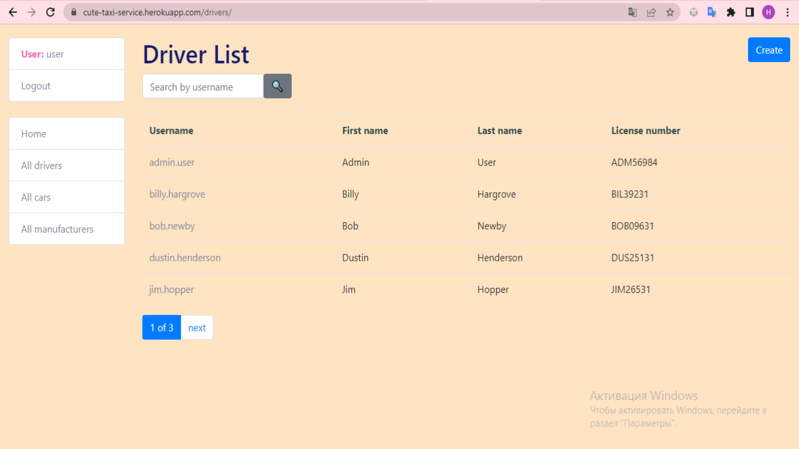

# Taxi service
Helps drivers create their own profile with detailed information and gives them the opportunity to choose the car on which they will work.

Helps the owner of the service to monitor the number of staff.

## Features

What's all the bells and whistles this project can perform?
* Authentication functionality for Driver/User
* IPowerful admin panel for advanced managing
* Managing drivers, cars & manufacturers directly from website

## Links
- Project homepage: https://cute-taxi-service.herokuapp.com/

  _**Credentials for a test user (username: user, password: User123456)**_





## Installing

Python3 must be already installed!

**for Windows OS**:
```shell 
git clone git@github.com:anastasia-martyniuk/taxi-service.git
python -m venv venv
source venv/Scripts/activate
pip install -r requirements.txt
python manage.py runserver
```

**for MAC OS**:
```shell 
git clone git@github.com:anastasia-martyniuk/taxi-service.git
python3 -m venv venv
source venv/bin/activate
pip install -r requirements.txt
python manage.py runserver
```
